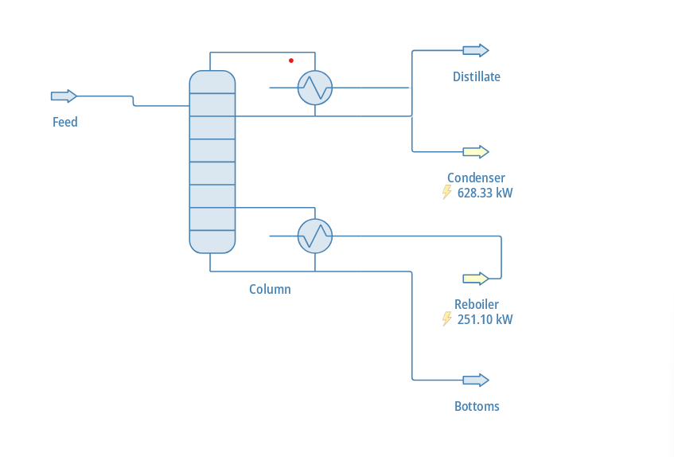

# Surrogate Modeling of Distillation Column using Machine Learning

---

## Project Overview

This project develops machine learning (ML) surrogate models to predict the behavior of a distillation column simulated in DWSIM. Instead of running computationally expensive simulations repeatedly, the trained ML models can quickly predict outputs based on input operating conditions.


---

## Objectives

- Automate DWSIM simulations using Python
- Generate a dataset of operating conditions and outputs
- Train multiple machine learning models
- Compare model performance
- Select the best surrogate model

---

## Inputs and Outputs

### Inputs (Features)

| Variable | Description |
|---|---|
| `T_feed` | Feed temperature |
| `P_feed` | Feed pressure |
| `z_benzene` | Feed composition |
| `reflux_ratio` | Reflux ratio |
| `stages` | Number of stages |
| `feed_stage` | Feed stage location |
| `bottoms_flow` | Bottoms flow rate |

### Outputs (Targets)

| Variable | Description |
|---|---|
| `xD` | Distillate composition |
| `xB` | Bottoms composition |
| `QC` | Condenser duty |
| `QR` | Reboiler duty |

---

## Project Structure

```
DWSIM_Surrogate_Project/
│
├── code/
│   ├── 01_data_cleaning.ipynb
│   ├── 02_eda_and_preprocessing.ipynb
│   ├── 03_model_training.ipynb
│   ├── generate_lhs_inputs.py
│   ├── lhs_input_cases.csv
│   ├── run_dwsim_cases.py
│   └── test_dwsim_connection.py
│
├── dataset/
│   ├── cleaned_dataset.csv
│   ├── failed_runs.csv
│   ├── lhs_input_cases.csv
│   └── raw_simulation_data.csv
│
└── DWSIM_Flowsheet/
    └── dwsim(ben-tol).dwxml
    └── flowchart.png
```

---

## Software Requirements

- Python 3.10+
- DWSIM (installed on your system)

### Required Python Libraries

```bash
pip install pandas numpy matplotlib scikit-learn xgboost
```

---

## Step-by-Step Instructions

### Step 1 — Open the DWSIM Flowsheet

1. Open **DWSIM**
2. Click **File → Open**
3. Navigate to `DWSIM_Flowsheet/dwsim(ben-tol).dwxml`
4. Verify the flowsheet loads correctly, all streams and units are connected, and the simulation runs manually

**Flowsheet Preview:**



---

### Step 2 — Generate Input Data (LHS Sampling)

Run the following from the project root:

```bash
cd code
python generate_lhs_inputs.py
```

**Output:** `code/lhs_input_cases.csv`

---

### Step 3 — Run DWSIM Simulations

```bash
python run_dwsim_cases.py
```

This script loads input cases, runs DWSIM simulations automatically, and extracts outputs.

**Outputs:**
- `dataset/raw_simulation_data.csv`
- `dataset/failed_runs.csv`

> **Note:** Update the DWSIM installation path inside `run_dwsim_cases.py` if required.

---

### Step 4 — Data Cleaning

Open and run all cells in:

```
code/01_data_cleaning.ipynb
```

This removes failed simulation cases and cleans the dataset.

**Output:** `dataset/cleaned_dataset.csv`

---

### Step 5 — Exploratory Data Analysis (Optional)

Open and run:

```
code/02_eda_and_preprocessing.ipynb
```

---

### Step 6 — Train Machine Learning Models

Open and run all cells in:

```
code/03_model_training.ipynb
```

Models trained:
- Polynomial Regression
- Random Forest
- XGBoost
- ANN (Artificial Neural Network)

Evaluation metrics used: **MAE**, **RMSE**, **R²**

---

### Step 7 — Reproducing Results

1. Ensure `dataset/cleaned_dataset.csv` exists
2. Open and run all cells in `code/03_model_training.ipynb`
3. Outputs: model performance tables, prediction comparison plots, and final model selection

---

## Model Performance & Accuracy

Each model was evaluated on a held-out test set (20% of data) using three metrics:
- **MAE** — Mean Absolute Error (lower is better)
- **RMSE** — Root Mean Squared Error (lower is better)
- **R²** — Coefficient of Determination (higher is better; 1.0 = perfect fit)

---

### xD — Distillate Composition

| Model | MAE | RMSE | R² |
|---|---|---|---|
| **Random Forest** | **0.0007** | **0.0014** | **0.9999** |
| XGBoost | 0.0016 | 0.0032 | 0.9994 |
| Polynomial Regression | 0.0228 | 0.0285 | 0.9541 |
| ANN | 0.0238 | 0.0304 | 0.9477 |

---

### xB — Bottoms Composition

| Model | MAE | RMSE | R² |
|---|---|---|---|
| **Random Forest** | **0.0007** | **0.0014** | **0.9999** |
| XGBoost | 0.0016 | 0.0032 | 0.9994 |
| Polynomial Regression | 0.0228 | 0.0285 | 0.9541 |
| ANN | 0.0238 | 0.0304 | 0.9477 |

---

### QC — Condenser Duty

| Model | MAE | RMSE | R² |
|---|---|---|---|
| **Random Forest** | **0.1450** | **0.3342** | **0.9999** |
| XGBoost | 0.4542 | 0.8805 | 0.9996 |
| ANN | 6.1494 | 8.4593 | 0.9667 |
| Polynomial Regression | 8.2216 | 9.8215 | 0.9551 |

---

### QR — Reboiler Duty

| Model | MAE | RMSE | R² |
|---|---|---|---|
| **Random Forest** | **0.1450** | **0.3342** | **0.9999** |
| XGBoost | 0.4542 | 0.8805 | 0.9996 |
| ANN | 6.1494 | 8.4593 | 0.9667 |
| Polynomial Regression | 8.2216 | 9.8215 | 0.9551 |

---

### Overall Model Ranking

| Rank | Model | Avg R² | Strengths | Weaknesses |
|---|---|---|---|---|
| 🥇 1 | **Random Forest** | ~0.9999 | Lowest MAE & RMSE across all outputs; most consistent | Slightly slower inference than XGBoost |
| 🥈 2 | **XGBoost** | ~0.9995 | Near-perfect accuracy; fast prediction | Marginally higher error than Random Forest |
| 🥉 3 | **Polynomial Regression** | ~0.9546 | Simple, interpretable | Higher error; struggles with nonlinear behavior |
| 4 | **ANN** | ~0.9572 | Theoretically flexible | Underperforms due to limited tuning and dataset size |

> **Random Forest** achieves R² ≈ 0.9999 across all four output variables, making it the clear best surrogate model for this distillation column.

---

## Results Summary

| Model | Performance |
|---|---|
| Random Forest | ✅ Highest accuracy, lowest error |
| XGBoost | ✅ High accuracy |
| Polynomial Regression | ⚠️ Captured trends but higher error |
| ANN | ⚠️ Lower performance (untuned) |

---

## Final Model

**Random Forest** was selected as the final surrogate model based on:
- Lowest prediction error (MAE, RMSE)
- Highest R² score
- Robust performance across all output variables

---

## Limitations

- Some input variables showed limited variation, affecting feature importance analysis
- Operating space coverage can be improved with denser sampling

---

## Future Work

- Improve input variable sampling range and density
- Perform hyperparameter tuning for ANN and XGBoost
- Deploy the model for real-time prediction

---

## Author

**Ishita**

---

## Notes

- Ensure DWSIM is properly installed before running simulation scripts
- All scripts should be run from within the `code/` directory
- Run scripts in order (Steps 2 → 3 → 4 → 6) for full reproducibility
